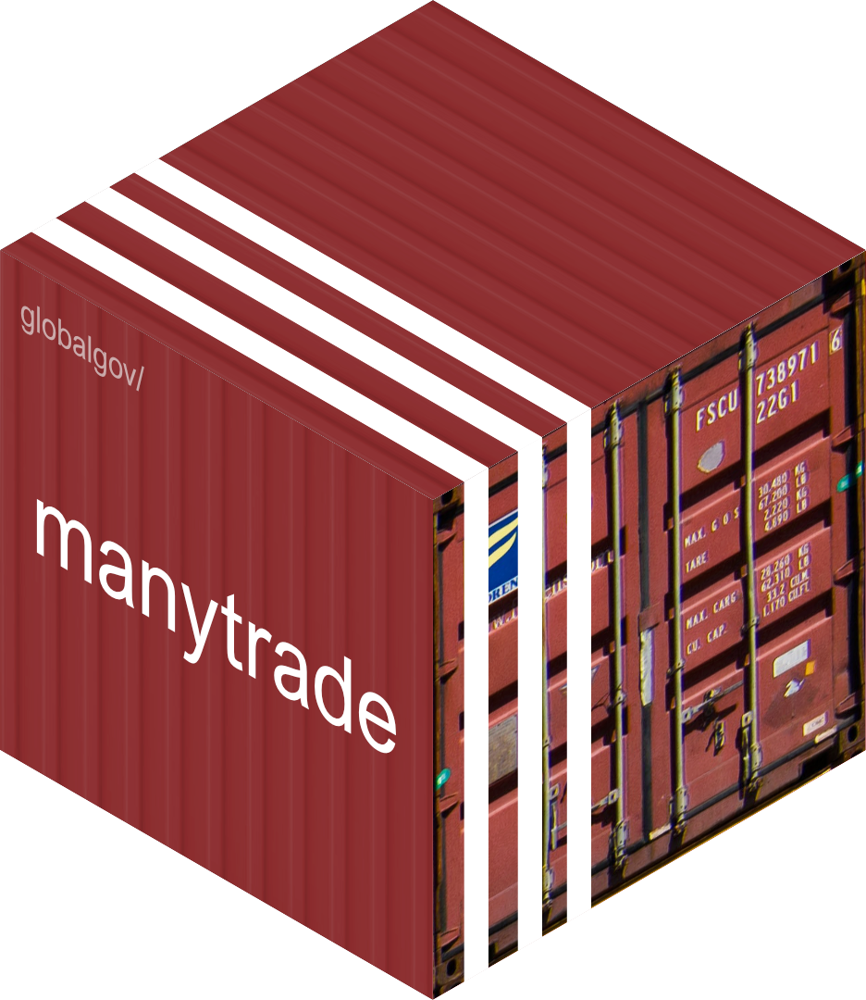

# manytrade 

<!-- badges: start -->

[](https://www.tidyverse.org/lifecycle/#experimental)


[](https://www.codefactor.io/repository/github/globalgov/manytrade/overview/main)
<!-- [](https://bestpractices.coreinfrastructure.org/projects/4867) -->
<!-- badges: end -->

manytrade is a data package in the [many
packages](https://github.com/globalgov/) universe. It currently includes
an ensemble of datasets on international trade agreements, and
[states](https://github.com/globalgov/manystates)’ membership or other
relationships to those agreements, including the original treaty texts
stored in the HUGGO dataset. Building on existing trade datasets such as
the Global Preferential Trade Agreements Database (GPTAD) and the Design
of Trade Agreements Dataset (DESTA), the AIGGO dataset in the
`agreements` database also includes information on the accession
conditions and procedures as well as more precise dates of signature
extracted from the treaty texts. Please also check out
[`{manydata}`](https://github.com/globalgov/manydata) for more about the
other packages in the ‘many packages’ universe.

## How to install:

We’ve made it easier than ever to install and start analysing global
governance data in R. Simply install the core package,
[manydata](https://github.com/globalgov/manydata), and then you can
discover, install and update various ‘many packages’ from the console.

``` r
# prints a list of the publicly available data packages currently available
manydata::get_packages()
```

    ## # A tibble: 7 x 6
    ##   Name        Repository            Installed Latest Updated    Description     
    ##   <chr>       <chr>                 <chr>     <chr>  <date>     <chr>           
    ## 1 manydata    globalgov/manydata    0.7.5     0.7.5  2022-06-07 An R portal for~
    ## 2 manyenviron globalgov/manyenviron 0.1.3     0.2.0  2022-10-10 Ensembled data ~
    ## 3 manyhealth  globalgov/manyhealth  <NA>      0.1.1  2022-02-15 Ensembled data ~
    ## 4 manypkgs    globalgov/manypkgs    0.2.2     0.2.2  2022-07-21 Support for cre~
    ## 5 manystates  globalgov/manystates  0.1.0     0.1.0  2022-08-17 Ensembled data ~
    ## 6 manytrade   globalgov/manytrade   0.1.2     0.1.2  2022-07-14 Ensembled data ~
    ## 7 messydates  globalgov/messydates  0.3.1     0.3.1  2022-07-21 An R package fo~

``` r
# manydata::get_packages("manytrade") # downloads and installs the named package
```

## Data included

Once you have installed the package, you can see the different databases
and datasets included in the {`manytrade`} package using the following
function.

``` r
manydata::data_contrast("manytrade")
```

    ## agreements :
    ##        Unique ID Missing Data Rows Columns        Beg End
    ## DESTA          0       4.21 %  959      10 1948-01-01  NA
    ## GPTAD          0        6.5 %  340      10 1957-03-25  NA
    ## LABPTA         0          0 %  483       7 1990-01-01  NA
    ## TOTA           0        0.1 %  450       7 1948-12-06  NA
    ## TREND          0       0.29 %  729       7 1947-01-01  NA
    ## AIGGO          0      23.32 % 1440       8 1947-01-01  NA
    ##                                                                                                                                                                                                                                        URL
    ## DESTA                                                                                                                                                                                   https://www.designoftradeagreements.org/downloads/
    ## GPTAD                                                                                                                                                                                        https://wits.worldbank.org/gptad/library.aspx
    ## LABPTA                                                                                                                                                                                           https://doi.org/10.1007/s11558-018-9301-z
    ## TOTA                                                                                                                                                                                           https://github.com/mappingtreaties/tota.git
    ## TREND                                                                                                                                                                                             http://www.chaire-epi.ulaval.ca/en/trend
    ## AIGGO  https://www.designoftradeagreements.org/downloads/, https://wits.worldbank.org/gptad/library.aspx, https://doi.org/10.1007/s11558-018-9301-z, http://www.chaire-epi.ulaval.ca/en/trend, https://github.com/mappingtreaties/tota.git
    ## 
    ## memberships :
    ##           Unique ID Missing Data Rows Columns        Beg End
    ## GPTAD_MEM         0       4.25 % 2198       9 1957-03-25  NA
    ## DESTA_MEM         0       6.16 % 7492       9 1948-01-01  NA
    ##                                                          URL
    ## GPTAD_MEM      https://wits.worldbank.org/gptad/library.aspx
    ## DESTA_MEM https://www.designoftradeagreements.org/downloads/
    ## 
    ## references :
    ##           Unique ID Missing Data Rows Columns Beg End
    ## DESTA_REF         0          0 %  584       3  NA  NA
    ##                                                          URL
    ## DESTA_REF https://www.designoftradeagreements.org/downloads/
    ## 
    ## texts :
    ##            Unique ID Missing Data Rows Columns        Beg End
    ## GNEVAR_TXT         0      31.12 % 1440      13 1947-01-01  NA
    ##                                                                                                                                                                                                                       URL
    ## GNEVAR_TXT https://wits.worldbank.org/gptad/library.aspx, http://rtais.wto.org/UI/PublicMaintainRTAHome.aspx, https://edit.wti.org/app.php/document/investment-treaty/search, https://github.com/mappingtreaties/tota.git

Working with ensembles of related data has many advantages for robust
analysis. Just take a look at our vignettes
[here](https://globalgov.github.io/manydata/articles/user.html).

## The ‘many packages’ universe

The [many packages](https://github.com/globalgov/) universe is aimed at
collecting, connecting and correcting network data across issue-domains
of global governance.

While the packages in the many universe can and do include novel data,
much of what they offer involves standing on the shoulders of giants.
The ‘many packages’ universe endeavours to be as transparent as possible
about where data comes from, how it has been coded and/or relabeled, and
who has done the work. As such, we make it easy to cite both the
particular datasets you use by listing the official references in the
function above, as well as the package providers for their work
assembling the data by using the function below.

``` r
citation("manytrade")
```

    ## 
    ## To cite manytrade in publications use:
    ## 
    ##   J. Hollway. Trade agreements for manydata. 2021.
    ## 
    ## A BibTeX entry for LaTeX users is
    ## 
    ##   @Manual{,
    ##     title = {manytrade: International Trade Agreements for manydata},
    ##     author = {James Hollway},
    ##     year = {2021},
    ##     url = {https://github.com/globalgov/manytrade},
    ##   }

## Contributing

[`{manypkgs}`](https://github.com/globalgov/manypkgs) also makes it easy
to contribute in lots of different ways.

If you have already developed a dataset salient to this package, please
reach out by flagging this as an
[issue](https://github.com/globalgov/manytrade/issues) for us, or by
forking, further developing the package yourself, and opening a [pull
request](https://github.com/globalgov/manytrade/pulls) so that your data
can be used easily.

If you have collected or developed other data that may not be best for
this package, but could be useful within the wider ‘many packages’
universe, [manypkgs](https://github.com/globalgov/manypkgs) includes a
number of functions that make it easy to create a new ‘many package’ and
populate it with clean, consistent global governance data.

If you have any other ideas about how this package or the ‘many
packages’ universe more broadly might better facilitate your empirical
analysis, we’d be very happy to hear from you.
